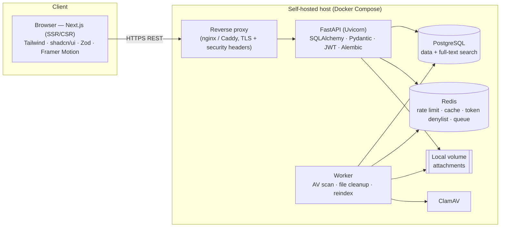

# Product Requirements Document — Network & IT Problems Documentation Platform

| Field | Value |
|-------|-------|
| **Product name** | NetDocs — Network & IT Problems Documentation Platform |
| **Version** | 0.2 (Draft) |
| **Date** | 2026-06-02 |
| **Author** | Software Engineering |
| **Status** | Draft — production-readiness pass applied |
| **Deployment** | Self-hosted / on-premise |
| **DB prerequisites** | PostgreSQL extensions: `pgcrypto` (`gen_random_uuid()`), `citext`, `pg_trgm` |

---

## 1. Overview

IT and network teams accumulate enormous **tribal knowledge** — how a VLAN misconfiguration was
diagnosed, why a switch kept dropping a trunk, which firmware fixed a VPN drop. Today this knowledge
lives in chat threads, email, and people's heads. When the same problem recurs months later, it is
re-diagnosed from scratch, wasting hours.

**NetDocs** is a self-hosted web application that gives an internal IT team a single, searchable place
to document network and IT problems — tying **symptom → root cause → resolution → affected devices** —
backed by a lightweight **network inventory**, **strong search**, and **attachments** (logs,
screenshots, configs, diagrams).

This is a **knowledge base**, not a ticketing system. It optimizes for fast capture and fast retrieval
of reusable troubleshooting knowledge.

---

## 2. Problem Statement

- **Lost knowledge:** Resolutions are not recorded; when an engineer leaves, their knowledge leaves too.
- **Repeated effort:** Recurring incidents are re-investigated because there is no record of prior fixes.
- **No linkage:** Problems aren't connected to the specific devices/sites they affect, so patterns
  (e.g. "this switch model keeps failing") are invisible.
- **Poor retrieval:** Even when notes exist, they're scattered and unsearchable.
- **Sensitive data:** Network details and configs cannot leave the premises — a SaaS tool is a
  non-starter, so the solution must be self-hostable.

---

## 3. Goals & Non-Goals

### 3.1 Goals (v1)
- **G1** — Capture a problem and its resolution in under 3 minutes.
- **G2** — Find a previously documented fix in under 30 seconds via search/filters.
- **G3** — Link every problem to the device(s)/site(s) it affects.
- **G4** — Attach supporting evidence (logs, screenshots, configs, diagrams) to any entry.
- **G5** — Run fully self-hosted with simple account-based login and role-based access.

### 3.2 Non-Goals (v1)
- Full ITSM ticketing, SLAs, approval workflows, or queue management.
- Multi-tenant / MSP client separation (single-tenant only in v1).
- Live device monitoring, SNMP polling, or auto-discovery.
- Single Sign-On (SAML/OIDC) and MFA — deferred (see §21).
- Public/customer-facing access.

---

## 4. Personas

| Persona | Role | Primary needs |
|---------|------|---------------|
| **Network Engineer / IT Admin** | Author & solver | Quickly log problems and resolutions; search prior fixes; manage inventory. |
| **IT Manager** | Reviewer / reporter | Browse, review, see recurring problems and trends. |
| **Helpdesk** | First-line capture | Create and edit problem entries; cannot delete or manage inventory. |
| **Viewer** | Read-only | Search and read known issues and resolutions; no write access. |

---

## 5. User Stories (with acceptance criteria)

### Epic A — Problem/Solution Knowledge Base
- **A1** — *As an engineer, I can create a problem entry with symptoms, root cause and resolution steps.*
  - AC: Required fields validated; entry saved with author and timestamp; appears in list immediately.
- **A2** — *As an engineer, I can mark a problem's status* (Open / Resolved / Known-issue).
  - AC: Status is filterable; changing status records `updated_at`.
- **A3** — *As an engineer, I can tag and categorize a problem.*
  - AC: Multiple tags + one category per problem; tags reusable across entries.
- **A4** — *As an engineer, I can link a problem to one or more devices.*
  - AC: Linked devices show on the problem; the device page lists its related problems.
- **A5** — *As an engineer, I can relate a problem to other problems.*
  - AC: Bi-directional "related problems" links shown on both entries.

### Epic B — Network Inventory
- **B1** — *As an admin, I can add a device with type, vendor, model, mgmt IP, MAC, site, rack, status, serial, asset tag, notes.*
  - AC: IP/MAC/hostname format validated; hostname unique; device appears in inventory list and search.
  - *(VLANs are documented separately, per switch — see Epic B3.)*
- **B3** — *As an engineer, I can document the VLANs configured on a switch.*
  - AC: Add/edit/remove VLANs (tag 1–4094, name, subnet, gateway) on a switch's detail page; tag unique per device.
- **B2** — *As an engineer, I can view a device and all problems that affected it.*

### Epic C — Search & Categorization
- **C1** — *As a user, I can full-text search across problems (title, symptoms, root cause, resolution).*
  - AC: Results ranked by relevance; query under 500 ms on 10k entries.
- **C2** — *As a user, I can filter by tag, category, severity, status, device, and date range, and sort.*

### Epic D — Attachments & Diagrams
- **D1** — *As an engineer, I can upload logs, screenshots, configs, and diagram images to an entry.*
  - AC: Allowed types & size enforced; files downloadable by authorized users only.

### Epic E — Auth & Admin
- **E1** — *As a user, I can log in with email/username + password and stay signed in (refresh token).*
- **E2** — *As a Network Admin, I can manage users and assign one or more roles* (Network Admin, SysAdmin, Security Analyst, Helpdesk, Viewer).
  - AC: A user may hold multiple roles; Viewers cannot create/edit; only Network Admin manages users and roles.

---

## 6. Functional Requirements

### 6.1 Problem/Solution Knowledge Base
| # | Requirement |
|---|-------------|
| FR-1 | Create/read/update/delete (CRUD) problem entries. |
| FR-2 | Fields: title, symptoms, severity (Low/Med/High/Critical), status (Open/Resolved/Known-issue), root cause, resolution steps (Markdown/rich text), category, tags[], affected devices[], related problems[], `reported_by` (who hit the issue — distinct from `created_by`/author), created_at, updated_at. |
| FR-3 | Soft-delete (archive) rather than hard-delete; archived entries excluded from default views. |
| FR-4 | Audit fields (created_by, updated_by, timestamps) on every entry. |

### 6.2 Network Inventory
| # | Requirement |
|---|-------------|
| FR-5 | CRUD devices with fields: unique `hostname`, `serial_number`, `asset_tag`, `device_type` (FK), `vendor` (FK), `site` (FK), `management_ip` (INET), `mac_address` (MACADDR), `model`, `firmware_version`, `os_version`, `rack` (FK) + `rack_position`, `status`, `notes`, timestamps. |
| FR-6 | Device ↔ Problem many-to-many linkage. |
| FR-7 | **Device types** as a managed lookup (e.g. Switch, Router, Firewall, Access Point, Server, UPS). |
| FR-8 | **Vendors** as a managed lookup with `name`, `website`, `support_contact` (e.g. Cisco, Fortinet, Ubiquiti). |
| FR-9 | **Sites** and **racks** as managed lookups; a rack belongs to a site, a device may be mounted in a rack at a given U-position. |
| FR-10 | `management_ip` validated as a valid IP (PostgreSQL `INET`); `mac_address` validated as a MAC (PostgreSQL `MACADDR`); `hostname` enforced unique. |
| FR-11 | **Document VLANs per switch:** each switch (device) has a list of VLANs with `vlan_id` (802.1Q tag, 1–4094), `name`, `description`, and optional `subnet` (CIDR) + `gateway` (INET). VLAN tag is unique within a device. Full CRUD from the device detail page. |

### 6.3 Search & Categorization
| # | Requirement |
|---|-------------|
| FR-12 | PostgreSQL full-text search (`tsvector`) over problem text fields, plus trigram (`pg_trgm`) for fuzzy matching on titles/device names. |
| FR-13 | Filters: tag, category, severity, status, device, site, date range. Combinable. |
| FR-14 | Sort by relevance, newest, recently updated. Paginated results. |
| FR-15 | Tags and **problem categories** are managed entities (rename merges references). Categories classify problems by domain — e.g. VPN, Active Directory, Printer, DNS, WiFi. |

### 6.4 Attachments & Diagrams
| # | Requirement |
|---|-------------|
| FR-16 | Upload files attached to a problem (and optionally a device). |
| FR-17 | Allowed types: images (png/jpg/svg/webp), text/logs, pdf, config files; configurable max size (default 25 MB). |
| FR-18 | Files stored on a local volume (self-hosted); DB stores metadata + path; download is access-controlled. |
| FR-19 | MIME-type and extension validation; filenames sanitized; stored under non-guessable keys. |

### 6.5 Authentication & Roles
| # | Requirement |
|---|-------------|
| FR-20 | Login with **email or username** + password; passwords hashed (argon2/bcrypt). Both `email` and `username` are unique. |
| FR-21 | JWT access token (short-lived) + refresh token (longer-lived, rotation + Redis denylist on logout). |
| FR-22 | **Roles are normalized** into a `roles` table with a many-to-many `user_roles` join — a user may hold **multiple roles**. Seeded roles: **Network Admin**, **SysAdmin**, **Security Analyst**, **Helpdesk**, **Viewer** (see §6.6 for the permission matrix). |
| FR-23 | User management: create/invite, deactivate (`is_active=false`), assign/revoke roles, reset password. Restricted to roles with the `users.manage` permission. |
| FR-24 | **Permissions are data-driven:** a `permissions` table holds granular capability codes (e.g. `problems.create`, `inventory.manage`, `users.manage`), and a `role_permissions` join grants permissions to roles. A user's **effective permissions** are the union of all permissions across their assigned roles. |
| FR-25 | Admins can create/edit custom roles and grant/revoke their permissions without code changes; seeded roles ship with a default permission set (§6.6). |

### 6.6 Roles & Permission Matrix

Authorization is **permission-based**: each capability below corresponds to a row in the `permissions`
table (a `code` such as `problems.create` or `inventory.manage`), granted to roles via `role_permissions`.
A user's effective permissions are the **union** of permissions across all roles assigned to them via
`user_roles`. The matrix is the **default seed** for the built-in roles — admins can change any grant
without code changes. Seeded roles:

| Capability | Network Admin | SysAdmin | Security Analyst | Helpdesk | Viewer |
|------------|:---:|:---:|:---:|:---:|:---:|
| Read / search problems & inventory | ✅ | ✅ | ✅ | ✅ | ✅ |
| Create / edit problems | ✅ | ✅ | ✅ | ✅ | — |
| Delete / archive problems | ✅ | ✅ | ✅ | — | — |
| Manage network inventory (devices, VLANs, ISP/WAN links, wireless, sites/racks) | ✅ | ✅ | — | — | — |
| Upload / download attachments | ✅ | ✅ | ✅ | ✅ | download only |
| Manage tags & categories | ✅ | ✅ | ✅ | — | — |
| Manage users & role assignments | ✅ | — | — | — | — |
| Manage roles (create/edit roles) | ✅ | — | — | — | — |
| Read audit log (`audit.read`) | ✅ | ✅ | ✅ | — | — |

> **Network Admin** is the superuser role (full content + user/role administration). **SysAdmin** has
> full content + inventory rights but not user administration. **Security Analyst** documents and edits
> problems (incl. security incidents) but does not manage inventory or users. **Helpdesk** captures and
> edits problems but cannot delete or manage inventory. **Viewer** is read-only.

### 6.7 ISP & WAN

| # | Requirement |
|---|-------------|
| FR-26 | CRUD ISP/WAN links per site: `provider_name`, `circuit_id`, `public_ip` (INET), `bandwidth_mbps`, `connection_type` (e.g. Fiber/DIA/Broadband/LTE/MPLS), `status` (e.g. Active/Down/Provisioning), `notes`. |
| FR-27 | A site may have **multiple ISP links** (primary + backup); each link belongs to one site. |
| FR-28 | ISP links are managed under the `inventory-admin` capability and are searchable/filterable by site, provider, status, and connection type. |

### 6.8 Wireless Infrastructure

| # | Requirement |
|---|-------------|
| FR-29 | CRUD wireless networks (SSIDs) per site: `ssid`, `security_type` (e.g. WPA2-PSK/WPA2-Enterprise/WPA3/Open), `hidden` (broadcast flag). |
| FR-30 | Each wireless network records its **VLAN tag** (802.1Q number, site-scoped) to document SSID → VLAN segmentation. |
| FR-31 | Wireless networks are managed under the `inventory-admin` capability and are filterable by site, security type, and VLAN. |

### 6.9 Sites & Locations

Critical for **multi-branch infrastructure** — sites anchor devices, racks, ISP links, wireless, and rooms.

| # | Requirement |
|---|-------------|
| FR-32 | CRUD sites: `name` (required), `google_map_location`, `city`, `country`, `timezone`, `notes`, `created_at`. |
| FR-33 | CRUD **rooms** within a site: `name`, `floor`, `purpose` (e.g. Server Room, MDF, IDF, Datacenter Hall). Deleting a site cascades to its rooms. |
| FR-34 | Sites and rooms are managed under the `inventory-admin` capability; sites are selectable wherever a location is referenced (devices, racks, ISP links, wireless). |
| FR-35 | A site detail view aggregates everything located there: devices, racks, rooms, ISP/WAN links, and wireless networks. |

### 6.10 Account Security & Session Management

| # | Requirement |
|---|-------------|
| FR-36 | **Password policy:** minimum length 12, checked against a common-password blocklist; hashed with argon2id. |
| FR-37 | **Brute-force protection:** progressive throttling + temporary account lockout after N consecutive failed logins (default 10), with admin unlock. Failed attempts recorded in the audit log. |
| FR-38 | **Refresh-token reuse detection:** tokens rotate on use; presenting an already-rotated token revokes the whole token family (Redis denylist) and forces re-login. |
| FR-39 | **Session visibility:** a user can view active sessions/devices and revoke them; admins can revoke any user's sessions. |
| FR-40 | **JWT key management:** tokens carry a `kid`; signing keys rotate with an overlapping validation window so rotation does not invalidate active sessions. Asymmetric signing (RS256/EdDSA) preferred. |
| FR-41 | **Password reset:** admin-initiated reset issues a one-time link / temporary password (no email dependency). If SMTP is configured, users may self-serve via a time-limited reset link. |
| FR-42 | **MFA** (TOTP) is **out of scope for v1** but the schema/flows must not preclude it (see §21). |

---

## 7. Non-Functional Requirements

| Category | Requirement |
|----------|-------------|
| **Security** | All input validated (Zod on frontend, Pydantic on backend); rate limiting on auth & write endpoints (Redis-backed); CSRF-safe token handling; HTTP security headers (CSP, HSTS, X-Content-Type-Options, Referrer-Policy, `frame-ancestors 'none'`); file-upload hardening + AV scan; secrets via env/Docker secrets, never committed. See §12. |
| **Performance** | Search results < 500 ms at 10k problems; common pages < 1 s (p95). |
| **Pagination** | Default `page_size = 25`, max `100`; cursor or offset pagination on all list endpoints. |
| **Rate limits** | Login: 5/min/IP **and** 10/min/account; other write endpoints: 60/min/user. Configurable; Redis-backed. |
| **Concurrency** | Optimistic locking on editable entities via `updated_at`/ETag (`If-Unmatched` → `409 Conflict`) so concurrent edits don't silently overwrite. |
| **Availability** | Single-node self-hosted acceptable for v1; documented backup/restore (§14); target RPO ≤ 24 h, RTO ≤ 4 h. |
| **Data** | Automated daily DB backup + WAL archiving (PITR); attachments on a persistent volume, backed up with the DB; data stays on-premise. |
| **Auditability** | `created_by`/`updated_by` + timestamps on all mutable entities; immutable `audit_log` for changes and auth/permission events (§22). |
| **Observability** | Structured JSON logs with request IDs; health (`/healthz`) + readiness (`/readyz`) probes; Prometheus `/metrics`. See §13. |
| **Migrations** | All schema changes ship as versioned **Alembic** migrations; no manual DDL in any environment. |
| **Accessibility** | **WCAG 2.1 AA** (keyboard nav, focus order, contrast, ARIA) via shadcn/ui + audit. |
| **Browser support** | Latest 2 versions of Chrome, Edge, Firefox, Safari. |
| **Maintainability** | Typed end-to-end (Python type hints + TypeScript); OpenAPI schema auto-generated by FastAPI; lint/format/type-check enforced in CI (§16). |
| **Deployment** | Docker Compose stack (app, db, redis, reverse proxy) for one-command self-hosting; config via env (§17). |

---

## 8. System Architecture



**Key decisions**
- **Backend:** FastAPI (async, auto OpenAPI docs) + SQLAlchemy (ORM) over PostgreSQL; **Alembic** for migrations.
- **Redis:** rate limiting, response caching for hot search/list queries, JWT refresh-token denylist, and a lightweight job queue for the worker.
- **Worker:** background process for antivirus scanning of uploads (ClamAV), orphaned-file cleanup, and FTS reindex/maintenance.
- **Frontend:** Next.js (App Router) with server components for fast first paint; Tailwind + shadcn/ui
  for consistent accessible UI; Zod for shared form/response validation; Framer Motion for transitions.
- **TLS:** terminated at the reverse proxy (Caddy auto-HTTPS or internal CA cert); HSTS + security headers set there.
- **Email (optional):** SMTP is optional; if unconfigured, password resets are admin-initiated (see §6.10).
- **Self-hosting:** everything ships as a Docker Compose stack; no external SaaS dependency.

---

## 9. Data Model

```mermaid
erDiagram
    USERS ||--o{ PROBLEMS : "authored"
    USERS }o--o{ ROLES : "assigned (user_roles)"
    ROLES }o--o{ PERMISSIONS : "granted (role_permissions)"
    PROBLEMS ||--o{ ATTACHMENTS : "has"
    DEVICES  ||--o{ ATTACHMENTS : "has"
    PROBLEMS }o--o{ DEVICES : "affects (problem_device)"
    PROBLEMS }o--o{ TAGS : "tagged (problem_tag)"
    PROBLEMS_CATEGORIES ||--o{ PROBLEMS : "categorizes"
    DEVICE_TYPES ||--o{ DEVICES : "classifies"
    VENDORS ||--o{ DEVICES : "supplies"
    SITES ||--o{ DEVICES : "located_at"
    SITES ||--o{ ROOMS : "contains"
    SITES ||--o{ RACKS : "houses"
    RACKS ||--o{ DEVICES : "mounts"
    DEVICES ||--o{ VLANS : "configures (per switch)"
    SITES ||--o{ ISP_LINKS : "served_by"
    SITES ||--o{ WIRELESS_NETWORKS : "broadcasts"
    USERS ||--o{ AUDIT_LOG : "acted"
    PROBLEMS }o--o{ PROBLEMS : "related (problem_relation)"

    USERS {
      uuid id PK
      string email UK
      string username UK
      string full_name
      text password_hash
      bool is_active
      timestamp created_at
      timestamp updated_at
    }
    ROLES {
      uuid id PK
      string name UK
      text description
    }
    USER_ROLES {
      uuid user_id FK
      uuid role_id FK
    }
    PERMISSIONS {
      uuid id PK
      string code UK
      text description
    }
    ROLE_PERMISSIONS {
      uuid role_id FK
      uuid permission_id FK
    }
    PROBLEMS {
      uuid id PK
      string title
      text symptoms
      text root_cause
      text resolution
      string severity
      string status
      uuid category_id FK
      uuid reported_by FK
      uuid created_by FK
      uuid updated_by FK
      bool is_archived
      tsvector search_vector
      timestamptz created_at
      timestamptz updated_at
    }
    DEVICES {
      uuid id PK
      string hostname UK
      string serial_number
      string asset_tag
      uuid device_type_id FK
      uuid vendor_id FK
      uuid site_id FK
      inet management_ip
      macaddr mac_address
      string model
      string firmware_version
      string os_version
      uuid rack_id FK
      int rack_position
      string status
      text notes
      timestamp created_at
      timestamp updated_at
    }
    DEVICE_TYPES { uuid id PK; string name UK }
    VENDORS {
      uuid id PK
      string name UK
      text website
      text support_contact
    }
    RACKS {
      uuid id PK
      string name
      uuid site_id FK
      int height_units
      text notes
    }
    VLANS {
      uuid id PK
      uuid device_id FK
      int vlan_id
      string name
      text description
      cidr subnet
      inet gateway
      timestamp created_at
      timestamp updated_at
    }
    ISP_LINKS {
      uuid id PK
      uuid site_id FK
      string provider_name
      string circuit_id
      inet public_ip
      int bandwidth_mbps
      string connection_type
      string status
      text notes
    }
    WIRELESS_NETWORKS {
      uuid id PK
      uuid site_id FK
      string ssid
      int vlan_tag
      string security_type
      bool hidden
    }
    AUDIT_LOG {
      uuid id PK
      uuid actor_id FK
      string action
      string entity_type
      uuid entity_id
      jsonb diff
      inet ip_address
      timestamptz created_at
    }
    TAGS { uuid id PK; string name UK }
    PROBLEMS_CATEGORIES { uuid id PK; string name UK }
    SITES {
      uuid id PK
      string name
      text google_map_location
      string city
      string country
      string timezone
      text notes
      timestamp created_at
    }
    ROOMS {
      uuid id PK
      uuid site_id FK
      string name
      string floor
      string purpose
    }
    ATTACHMENTS {
      uuid id PK
      uuid problem_id FK
      uuid device_id FK
      string filename
      string storage_key
      string mime_type
      int size_bytes
      uuid uploaded_by FK
      timestamp created_at
    }
```

**Conventions** (applied to every table; omitted from the diagram for brevity):
- All `id` columns are `UUID PRIMARY KEY DEFAULT gen_random_uuid()`.
- All time columns are `TIMESTAMPTZ` storing UTC; `updated_at` is maintained by a trigger.
- All **mutable** entities (problems, devices, vlans, isp_links, wireless_networks, sites, rooms, racks)
  carry `created_by` and `updated_by` (FK → users) plus `created_at`/`updated_at`.
- `users.email`/`users.username` use `CITEXT` for case-insensitive uniqueness.
- `wireless_networks.vlan_tag` is the 802.1Q tag **number** (site-scoped), not a FK to a switch-owned
  `vlans` row — this avoids tying a site-wide SSID to one switch's VLAN entry.

**Indexes**: GIN index on `problems.search_vector` (FTS, a `GENERATED ALWAYS … STORED` column);
`pg_trgm` GIN on `problems.title` and `devices.hostname`; unique indexes on `users.email`,
`users.username`, `roles.name`, `permissions.code`, `device_types.name`, `vendors.name`, `devices.hostname`;
composite PKs on `user_roles(user_id, role_id)` and `role_permissions(role_id, permission_id)`, both with
cascade delete; FK indexes on `devices(device_type_id, vendor_id, site_id, rack_id)`; unique
`vlans(device_id, vlan_id)` with an index on `vlans.device_id`; FK indexes on `isp_links.site_id`,
`wireless_networks.site_id`, `rooms.site_id`, and `audit_log(entity_type, entity_id)` + `audit_log.actor_id`;
FKs and `(status, severity, created_at)` composite on `problems` for filtered lists.

---

## 10. API Design (representative REST endpoints)

Base path: `/api/v1`. Auth: `Authorization: Bearer <access_token>`. Errors return a consistent shape
`{ "detail": "...", "code": "...", "request_id": "..." }`. List endpoints support `?page=&page_size=&sort=`
(default `page_size=25`, max `100`). Mutations on editable entities accept an `If-Unmatched`/ETag header
for optimistic concurrency (mismatch → `409 Conflict`).

| Method & Path | Description | Required permission |
|---------------|-------------|----------|
| `POST /auth/login` | Email+password → access + refresh tokens | public |
| `POST /auth/refresh` | Rotate refresh → new access token | auth |
| `POST /auth/logout` | Revoke refresh token (Redis denylist) | auth |
| `GET /auth/me` | Current user profile | auth |
| `GET /problems` | List/filter/search problems (`?q=&tag=&category=&severity=&status=&device=&site=&from=&to=`) | viewer |
| `POST /problems` | Create problem | editor |
| `GET /problems/{id}` | Problem detail (+ devices, tags, attachments, related) | viewer |
| `PATCH /problems/{id}` | Update problem | editor |
| `DELETE /problems/{id}` | Archive problem | editor |
| `GET /devices` | List/search devices | viewer |
| `POST /devices` | Create device | editor |
| `GET /devices/{id}` | Device detail + related problems | viewer |
| `PATCH /devices/{id}` / `DELETE /devices/{id}` | Update / retire device | editor |
| `GET /devices/{id}/vlans` | List VLANs configured on a switch | viewer |
| `POST /devices/{id}/vlans` | Add a VLAN to a switch | inventory-admin |
| `PATCH /vlans/{id}` / `DELETE /vlans/{id}` | Update / remove a VLAN | inventory-admin |
| `GET /isp-links` | List/filter ISP/WAN links (`?site=&provider=&status=&type=`) | viewer |
| `POST /isp-links` / `PATCH /isp-links/{id}` / `DELETE /isp-links/{id}` | Manage ISP/WAN links | inventory-admin |
| `GET /wireless-networks` | List/filter SSIDs (`?site=&security=&vlan=`) | viewer |
| `POST /wireless-networks` / `PATCH /wireless-networks/{id}` / `DELETE /wireless-networks/{id}` | Manage wireless networks | inventory-admin |
| `GET /device-types`, `GET /vendors`, `GET /racks` | Inventory lookups | viewer |
| `POST/PATCH/DELETE /device-types`, `/vendors`, `/racks` | Manage inventory lookups | inventory-admin |
| `GET /tags`, `GET /problem-categories` | Lookups | viewer |
| `POST /tags`, `POST /problem-categories` | Create lookup | editor |
| `GET /sites`, `GET /sites/{id}` | List sites / site detail (aggregates devices, racks, rooms, ISP links, wireless) | viewer |
| `POST /sites` / `PATCH /sites/{id}` / `DELETE /sites/{id}` | Manage sites | inventory-admin |
| `GET /sites/{id}/rooms` | List rooms in a site | viewer |
| `POST /sites/{id}/rooms` / `PATCH /rooms/{id}` / `DELETE /rooms/{id}` | Manage rooms | inventory-admin |
| `POST /problems/{id}/attachments` | Upload file (multipart) | editor |
| `GET /attachments/{id}` | Download (access-controlled) | viewer |
| `GET /users` / `POST /users` / `PATCH /users/{id}` | User management (incl. `is_active`) | user-admin |
| `PUT /users/{id}/roles` | Assign/replace a user's roles | user-admin |
| `GET /roles` | List roles (with their permissions) | viewer |
| `POST /roles` / `PATCH /roles/{id}` / `DELETE /roles/{id}` | Manage roles | role-admin |
| `PUT /roles/{id}/permissions` | Grant/replace a role's permissions | role-admin |
| `GET /permissions` | List all permission codes | viewer |
| `GET /auth/me/permissions` | Current user's effective permissions (union across roles) | auth |
| `GET /audit-log` | List/filter audit events (`?actor=&entity_type=&entity_id=&from=&to=`) | audit.read |
| `GET /healthz`, `GET /readyz`, `GET /metrics` | Liveness, readiness, Prometheus metrics | public (metrics may be network-restricted) |

> **Permission legend:** the *Required permission* column names the **permission code** (or short alias)
> checked server-side. `public` = unauthenticated; `auth` = any logged-in user; `viewer` = the `*.read`
> permissions; `editor` = `problems.write`; `inventory-admin` = `inventory.manage`; `user-admin` =
> `users.manage`; `role-admin` = `roles.manage`; `audit.read` = read the audit log. A request is
> authorized when the caller's **effective permissions** (union across their roles) include the required
> code. Built-in roles map to these per §6.6.

FastAPI auto-publishes interactive OpenAPI docs at `/docs`.

---

## 11. Frontend Specification

| Route | Page | Notes |
|-------|------|-------|
| `/login` | Login | Zod-validated form; redirect on success. |
| `/` | Dashboard | Recent problems, quick search, counts by status/severity. |
| `/problems` | Problems list | Search box + filter sidebar (tag/category/severity/status/device/site/date), paginated table. |
| `/problems/new`, `/problems/[id]/edit` | Problem editor | Markdown editor for resolution; device/tag pickers; attachment uploader. |
| `/problems/[id]` | Problem detail | Symptoms → root cause → resolution, linked devices, related problems, attachments. |
| `/inventory` | Device list | Filter by device type / vendor / site / rack / status; search by hostname/IP/serial/asset tag. |
| `/inventory/[id]` | Device detail | Full device fields (type, vendor, site, rack + U-position, mgmt IP, MAC, model, firmware/OS) + related problems + attachments. For switches, a **VLAN table** (tag, name, subnet, gateway) with inline add/edit/delete. |
| `/inventory/isp-links` | ISP & WAN links | List/filter by site/provider/status; add/edit links (provider, circuit ID, public IP, bandwidth, type, status). |
| `/inventory/wireless` | Wireless networks | List/filter SSIDs by site/security/VLAN; add/edit (SSID, security type, VLAN, hidden). |
| `/sites` | Sites list | Multi-branch overview: name, city, country, timezone; search/filter. |
| `/sites/[id]` | Site detail | Site fields + Google Map link + rooms (name/floor/purpose) and aggregated devices, racks, ISP links, wireless. |
| `/admin/inventory` | Lookups management | Network Admin / SysAdmin; manage device types, vendors, sites, rooms, racks. |
| `/search` | Global search results | Cross-entity relevance-ranked results. |
| `/admin/users` | User management | Network Admin only; create/deactivate, assign multiple roles. |
| `/admin/roles` | Role & permission management | Network Admin only; create/edit roles + descriptions and grant/revoke permissions per role (permission matrix UI). |

**Stack usage:** Tailwind + shadcn/ui components; **Zod** schemas shared between forms and API response
parsing; **Framer Motion** for page/list transitions and modal animations; Next.js server components
for list/detail data fetching with client components for interactive forms.

---

## 12. Security & Compliance

- **Auth:** short-lived JWT access token; rotating refresh token with Redis denylist on logout/rotation.
- **RBAC:** enforced server-side on every endpoint via **permission checks** against the user's effective
  permissions — the union resolved through `users` ⇄ `user_roles` ⇄ `roles` ⇄ `role_permissions` ⇄
  `permissions`. Seeded roles Network Admin / SysAdmin / Security Analyst / Helpdesk / Viewer ship with
  default permission grants (see §6.6). Effective permissions are cached in Redis per session for speed.
- **Rate limiting:** Redis-backed limits on login and write endpoints to deter brute force/abuse.
- **Validation:** Pydantic (backend) + Zod (frontend) on all inputs; reject unexpected fields.
- **Uploads:** allow-list MIME types, size caps, filename sanitization, non-guessable storage keys,
  authorization check on download.
- **Secrets:** environment variables / Docker secrets; never committed; rotate DB and JWT signing keys (`kid` + overlap window, §6.10).
- **Security headers:** CSP, HSTS, `X-Content-Type-Options: nosniff`, `Referrer-Policy`, `frame-ancestors 'none'` set at the reverse proxy.
- **Uploads:** allow-list MIME types + extension match; **SVG disallowed (or sanitized)** to prevent stored XSS; ClamAV scan before a file is downloadable; downloads served with `Content-Disposition: attachment` via short-lived signed URLs.
- **Data residency:** fully on-premise; no third-party data egress.

---

## 13. Observability & Operations

- **Logging:** structured JSON logs (level, timestamp, `request_id`, `actor_id`, route, latency, status). No secrets/PII in logs. Correlate by `request_id` propagated from the reverse proxy.
- **Health/readiness:** `/healthz` (process up) and `/readyz` (DB + Redis reachable, migrations current) for the reverse proxy / orchestrator.
- **Metrics:** Prometheus `/metrics` — request rate/latency/error counts, DB pool usage, queue depth, login-failure rate. Optional Grafana dashboard shipped in the repo.
- **Alerting (guidance):** sample alert rules for error-rate spikes, login-failure spikes (possible brute force), disk usage on the attachments volume, and backup-job failure.
- **Audit log:** every write and auth/permission event recorded in `audit_log` (actor, action, entity, before/after `diff`, IP, time); surfaced read-only at `/audit-log` to `audit.read` holders.

---

## 14. Backup, Restore & Disaster Recovery

- **Database:** automated nightly `pg_dump` **plus** continuous WAL archiving for point-in-time recovery. Targets: **RPO ≤ 24 h**, **RTO ≤ 4 h**.
- **Attachments:** the file volume is snapshotted/backed up on the same schedule as the DB so metadata and files stay consistent.
- **Encryption & offsite:** backups encrypted at rest; at least one copy stored off the primary host.
- **Restore drill:** a documented, periodically tested restore runbook (restore DB + volume into a clean stack and verify).
- **Retention:** configurable backup retention (default 30 daily / 12 monthly).

---

## 15. Testing & QA

- **Backend unit/integration:** `pytest` with a disposable PostgreSQL (testcontainers or compose service); cover RBAC permission checks, FTS, validation, and auth flows.
- **API contract:** tests assert responses against the generated OpenAPI schema; schema diffed in CI to catch breaking changes.
- **Frontend:** component tests (Vitest/RTL) and **Playwright** e2e for the core flows (login, create/search problem, manage device + VLANs, role/permission edit).
- **Security checks:** dependency scanning (pip-audit/npm audit), SAST, secret scanning, and an upload-handling test (malicious file rejected, SVG blocked).
- **Coverage gates:** target ≥ 80% on backend domain/service code; CI fails below threshold.
- **Seed/fixtures:** reproducible seed data (roles, permissions, demo site/devices) for local dev and e2e.

---

## 16. CI/CD & Release

- **Pipeline:** on every PR — lint + format (ruff/black, eslint/prettier), type-check (mypy, tsc), unit/integration/e2e tests, **migration check** (migrations apply cleanly + match models), and security scans.
- **Build/publish:** build versioned Docker images for API, worker, and frontend; tag by semver + git SHA.
- **Migrations:** Alembic migrations run automatically on deploy **before** the app starts; `/readyz` reports migration status. Forward-only; destructive changes gated.
- **Release:** semantic versioning + changelog; staging deploy → smoke tests → promote to production. Documented rollback (previous image + down-migration or restore).

---

## 17. Configuration & Environments

- **Environments:** `dev`, `staging`, `prod` — identical images, differing only by config.
- **Config surface (env / Docker secrets):** `DATABASE_URL`, `REDIS_URL`, `JWT_PRIVATE_KEY`/`JWT_PUBLIC_KEY` (+ `kid`), `ACCESS_TOKEN_TTL`, `REFRESH_TOKEN_TTL`, `UPLOAD_DIR`, `MAX_UPLOAD_MB`, `ALLOWED_MIME_TYPES`, `CORS_ORIGINS`, rate-limit values, `SMTP_*` (optional), `BOOTSTRAP_ADMIN_EMAIL`/`BOOTSTRAP_ADMIN_PASSWORD`.
- **First-run bootstrap:** initial migration seeds the permission catalog and built-in roles (§6.6); on first boot the app creates the initial **Network Admin** from the bootstrap env vars (and requires a password change on first login). No hard-coded credentials.
- **Twelve-factor config:** no environment-specific values baked into images; all via env.

---

## 18. Milestones / Phased Rollout

| Milestone | Scope |
|-----------|-------|
| **M1 — Foundation & Auth** | Scaffolding, Docker Compose, **Alembic** migrations, DB schema, JWT login, roles/permissions + bootstrap admin, CI skeleton (lint/type/test). |
| **M2 — Problem KB** | Problem CRUD, categories, tags, statuses, Markdown resolution editor, optimistic concurrency, audit log. |
| **M3 — Inventory & Linking** | Device CRUD, sites/rooms/racks, VLANs-per-switch, ISP & wireless, problem↔device linkage, related problems. |
| **M4 — Search & Filtering** | PostgreSQL FTS (generated `search_vector`) + trigram, filter sidebar, sorting, pagination. |
| **M5 — Attachments** | Upload/download, validation, AV scan (worker), local-volume storage, signed download URLs, access control. |
| **M6 — Security Hardening** | Account lockout, refresh-token reuse detection, JWT key rotation, security headers, rate limits, password-reset flow. |
| **M7 — Ops & Release** | Observability (logs/metrics/health), backup/restore + DR drill, full CI/CD, e2e tests, docs, deployment polish. |

---

## 19. Success Metrics

- **Time-to-find** a prior fix: median < 30 s.
- **Coverage:** ≥ 80% of resolved incidents have a documented entry within first quarter of use.
- **Reuse:** measurable repeat views/searches of existing entries (knowledge actually reused).
- **Adoption:** weekly active editors among the IT team.

---

## 20. Risks & Mitigations

| Risk | Mitigation |
|------|------------|
| Scope creep toward full ITSM | Explicit non-goals (§3.2); keep v1 KB-focused. |
| Attachment storage growth | Size caps; periodic cleanup of archived entries; documented volume sizing. |
| Search relevance dissatisfaction | Combine FTS ranking + trigram fuzzy + filters; iterate on weighting. |
| Self-hosted ops burden | One-command Docker Compose; documented backup/restore. |
| Low adoption / poor data entry | Fast capture UX (<3 min); templates; required-field guidance. |
| Malicious file upload | MIME allow-list, SVG blocked/sanitized, ClamAV scan, signed attachment-only downloads (§12). |
| Single-node outage / data loss | Nightly backups + WAL PITR, tested restore runbook, RPO/RTO targets (§14). |
| Referential-integrity gaps on deletes | Explicit `ON DELETE` rules per FK (RESTRICT/SET NULL/CASCADE) defined in the DDL (§22). |

---

## 21. Open Questions / Future Enhancements

- **MFA** (TOTP) for accounts — deferred from v1 (FR-42); schema/flows must remain compatible.
- **SSO** (SAML/OIDC, e.g. Azure AD / Google Workspace) — likely next major auth requirement.
- **Multi-tenant / MSP** mode for serving multiple client networks.
- **Monitoring integrations** (SNMP, syslog, alerting) to auto-create problem stubs.
- **Reporting/exports** (PDF/CSV, recurring-problem analytics, MTTR-style metrics) — also delivers the "recurring problem" pattern detection promised in §2/G3.
- **Network topology/diagram editor** beyond static image attachments.
- **Notifications** (email/Slack) on new known-issues or status changes.
- **Site-wide VLAN model:** if VLANs need to span switches as one shared definition, promote `vlans` to site-scoped with a `device_vlans` junction (§22.5).

---

## 22. Appendix

### 22.1 Glossary
- **KB** — Knowledge Base.
- **FTS** — Full-Text Search (PostgreSQL `tsvector`).
- **RBAC** — Role-Based Access Control.
- **Known-issue** — a documented problem without (or pending) a permanent fix.
- **RPO / RTO** — Recovery Point / Time Objective (max acceptable data loss / downtime).
- **PITR** — Point-In-Time Recovery (restore via WAL replay).
- **CSP / HSTS** — Content-Security-Policy / HTTP Strict-Transport-Security headers.
- **MFA / SSO** — Multi-Factor Authentication / Single Sign-On.
- **MDF / IDF** — Main / Intermediate Distribution Frame (wiring rooms).

### 22.2 Technology Stack Summary

| Layer | Technology | Role |
|-------|-----------|------|
| Frontend framework | **Next.js** | SSR/CSR React app, routing, data fetching. |
| Styling | **Tailwind CSS** | Utility-first styling. |
| UI components | **shadcn/ui** | Accessible, consistent component library. |
| Validation | **Zod** | Shared schema validation (forms + API responses). |
| Animation | **Framer Motion** | Page/list/modal transitions. |
| Backend framework | **FastAPI** | Async REST API, auto OpenAPI docs. |
| ORM | **SQLAlchemy** | Database models and queries. |
| Database | **PostgreSQL** | Primary store + full-text/trigram search. |
| Cache / limits | **Redis** | Rate limiting, caching, token denylist. |
| Auth | **JWT** | Access + refresh token authentication. |
| Deployment | **Docker Compose** | Self-hosted, single-command stack. |

### 22.3 Authentication Schema (DDL)

Normalized auth model — `users`, `roles`, `permissions`, and the many-to-many joins (a user may hold
multiple roles; effective permissions are the union; see §6.6). `password_hash` stores an **argon2id**
hash. Email/username use `CITEXT` for case-insensitive uniqueness.

> **Prerequisite extensions** (run once): `CREATE EXTENSION IF NOT EXISTS pgcrypto;`
> `CREATE EXTENSION IF NOT EXISTS citext;` `CREATE EXTENSION IF NOT EXISTS pg_trgm;`

```sql
CREATE TABLE users (
    id UUID PRIMARY KEY DEFAULT gen_random_uuid(),
    email CITEXT UNIQUE NOT NULL,
    username CITEXT UNIQUE NOT NULL,
    full_name VARCHAR(255),
    password_hash TEXT NOT NULL,          -- argon2id
    is_active BOOLEAN NOT NULL DEFAULT TRUE,
    failed_login_count INTEGER NOT NULL DEFAULT 0,
    locked_until TIMESTAMPTZ,
    must_change_password BOOLEAN NOT NULL DEFAULT FALSE,
    last_login_at TIMESTAMPTZ,
    created_at TIMESTAMPTZ NOT NULL DEFAULT now(),
    updated_at TIMESTAMPTZ NOT NULL DEFAULT now()
);

CREATE TABLE roles (
    id UUID PRIMARY KEY DEFAULT gen_random_uuid(),
    name VARCHAR(100) UNIQUE NOT NULL,
    description TEXT,
    is_system BOOLEAN NOT NULL DEFAULT FALSE   -- built-in roles cannot be deleted
);
-- Seeded roles: Network Admin, SysAdmin, Security Analyst, Helpdesk, Viewer

CREATE TABLE user_roles (
    user_id UUID NOT NULL REFERENCES users(id) ON DELETE CASCADE,
    role_id UUID NOT NULL REFERENCES roles(id) ON DELETE CASCADE,
    PRIMARY KEY (user_id, role_id)
);

CREATE TABLE permissions (
    id UUID PRIMARY KEY DEFAULT gen_random_uuid(),
    code VARCHAR(100) UNIQUE NOT NULL,
    description TEXT
);
-- Examples: problems.read, problems.write, problems.delete, inventory.manage,
--           attachments.upload, users.manage, roles.manage, audit.read

CREATE TABLE role_permissions (
    role_id UUID NOT NULL REFERENCES roles(id) ON DELETE CASCADE,
    permission_id UUID NOT NULL REFERENCES permissions(id) ON DELETE CASCADE,
    PRIMARY KEY (role_id, permission_id)
);
```

### 22.4 Inventory Schema (DDL)

Normalized inventory model — `device_types` and `vendors` are managed lookups; `devices` references
them plus `sites` and `racks`. The `racks` table is defined here because it is referenced by the
`devices.rack_id` FK (a rack belongs to a site). PostgreSQL native types `INET` and `MACADDR` validate
management IPs and MAC addresses.

`ON DELETE` rules: a device's type/vendor/site/rack are `SET NULL` (deleting a lookup must not delete
the device); a rack's site is `SET NULL`. Lookups in active use can also be guarded with `RESTRICT` if
you prefer to block deletion — choose per operational policy.

```sql
CREATE TABLE device_types (
    id UUID PRIMARY KEY DEFAULT gen_random_uuid(),
    name VARCHAR(100) UNIQUE NOT NULL
);
-- Examples: Switch, Router, Firewall, Access Point, Server, UPS

CREATE TABLE vendors (
    id UUID PRIMARY KEY DEFAULT gen_random_uuid(),
    name VARCHAR(100) UNIQUE NOT NULL,
    website TEXT,
    support_contact TEXT
);
-- Examples: Cisco, Fortinet, Ubiquiti

CREATE TABLE racks (
    id UUID PRIMARY KEY DEFAULT gen_random_uuid(),
    name VARCHAR(100) NOT NULL,
    site_id UUID REFERENCES sites(id) ON DELETE SET NULL,
    height_units INTEGER,
    notes TEXT,
    created_by UUID REFERENCES users(id) ON DELETE SET NULL,
    updated_by UUID REFERENCES users(id) ON DELETE SET NULL,
    created_at TIMESTAMPTZ NOT NULL DEFAULT now(),
    updated_at TIMESTAMPTZ NOT NULL DEFAULT now()
);

CREATE TABLE devices (
    id UUID PRIMARY KEY DEFAULT gen_random_uuid(),
    hostname VARCHAR(255) UNIQUE NOT NULL,
    serial_number VARCHAR(255),
    asset_tag VARCHAR(100),
    device_type_id UUID REFERENCES device_types(id) ON DELETE SET NULL,
    vendor_id UUID REFERENCES vendors(id) ON DELETE SET NULL,
    site_id UUID REFERENCES sites(id) ON DELETE SET NULL,

    management_ip INET,
    mac_address MACADDR,

    model VARCHAR(255),
    firmware_version VARCHAR(255),
    os_version VARCHAR(255),

    rack_id UUID REFERENCES racks(id) ON DELETE SET NULL,
    rack_position INTEGER,

    status VARCHAR(50) NOT NULL DEFAULT 'active',   -- active | spare | retired
    notes TEXT,

    created_by UUID REFERENCES users(id) ON DELETE SET NULL,
    updated_by UUID REFERENCES users(id) ON DELETE SET NULL,
    created_at TIMESTAMPTZ NOT NULL DEFAULT now(),
    updated_at TIMESTAMPTZ NOT NULL DEFAULT now()
);
```

### 22.5 VLAN Schema (DDL)

VLANs are documented **per switch**: each row belongs to one device, and a VLAN tag is unique within
that device. `subnet` (CIDR) and `gateway` (INET) are optional for documenting the L3 SVI.

```sql
CREATE TABLE vlans (
    id UUID PRIMARY KEY DEFAULT gen_random_uuid(),
    device_id UUID NOT NULL REFERENCES devices(id) ON DELETE CASCADE,
    vlan_id INTEGER NOT NULL CHECK (vlan_id BETWEEN 1 AND 4094),
    name VARCHAR(255),
    description TEXT,
    subnet CIDR,
    gateway INET,
    created_by UUID REFERENCES users(id) ON DELETE SET NULL,
    updated_by UUID REFERENCES users(id) ON DELETE SET NULL,
    created_at TIMESTAMPTZ NOT NULL DEFAULT now(),
    updated_at TIMESTAMPTZ NOT NULL DEFAULT now(),
    UNIQUE (device_id, vlan_id)
);
```

> **Design note:** VLANs are scoped to a single device, which directly satisfies "document VLANs on
> every switch." If you later need a VLAN that spans multiple switches as one shared definition, promote
> `vlans` to a site-level table and add a `device_vlans(device_id, vlan_id)` junction (with optional
> tagged/untagged + port columns). Deferred until needed.

### 22.6 ISP & WAN Schema (DDL)

Each site can have one or more ISP/WAN links (primary + backup). `public_ip` uses PostgreSQL `INET`.

```sql
CREATE TABLE isp_links (
    id UUID PRIMARY KEY DEFAULT gen_random_uuid(),
    site_id UUID NOT NULL REFERENCES sites(id) ON DELETE CASCADE,
    provider_name VARCHAR(255),
    circuit_id VARCHAR(255),
    public_ip INET,
    bandwidth_mbps INTEGER,
    connection_type VARCHAR(50),       -- Fiber | DIA | Broadband | LTE | MPLS
    status VARCHAR(50),                -- Active | Down | Provisioning
    notes TEXT,
    created_by UUID REFERENCES users(id) ON DELETE SET NULL,
    updated_by UUID REFERENCES users(id) ON DELETE SET NULL,
    created_at TIMESTAMPTZ NOT NULL DEFAULT now(),
    updated_at TIMESTAMPTZ NOT NULL DEFAULT now()
);
```

### 22.7 Wireless Infrastructure Schema (DDL)

Each site broadcasts one or more wireless networks (SSIDs); `vlan_tag` records the 802.1Q VLAN **number**
(site-scoped) for SSID → VLAN segmentation, rather than FK-ing a single switch's VLAN row (see §9 note).

```sql
CREATE TABLE wireless_networks (
    id UUID PRIMARY KEY DEFAULT gen_random_uuid(),
    site_id UUID NOT NULL REFERENCES sites(id) ON DELETE CASCADE,
    ssid VARCHAR(255) NOT NULL,
    vlan_tag INTEGER CHECK (vlan_tag BETWEEN 1 AND 4094),
    security_type VARCHAR(50),          -- WPA2-PSK | WPA2-Enterprise | WPA3 | Open
    hidden BOOLEAN NOT NULL DEFAULT FALSE,
    created_by UUID REFERENCES users(id) ON DELETE SET NULL,
    updated_by UUID REFERENCES users(id) ON DELETE SET NULL,
    created_at TIMESTAMPTZ NOT NULL DEFAULT now(),
    updated_at TIMESTAMPTZ NOT NULL DEFAULT now()
);
```

### 22.8 Problem Categories Schema (DDL)

Managed lookup that classifies problems by domain. Referenced by `problems.category_id` (see §9).

```sql
CREATE TABLE problems_categories (
    id UUID PRIMARY KEY DEFAULT gen_random_uuid(),
    name VARCHAR(255) UNIQUE NOT NULL
);
-- Examples: VPN, Active Directory, Printer, DNS, WiFi
```

### 22.9 Sites & Locations Schema (DDL)

Sites anchor multi-branch infrastructure; rooms are sub-locations within a site (cascade on site delete).

```sql
CREATE TABLE sites (
    id UUID PRIMARY KEY DEFAULT gen_random_uuid(),
    name VARCHAR(255) NOT NULL,
    google_map_location TEXT,
    city VARCHAR(100),
    country VARCHAR(100),
    timezone VARCHAR(100),
    notes TEXT,
    created_by UUID REFERENCES users(id) ON DELETE SET NULL,
    updated_by UUID REFERENCES users(id) ON DELETE SET NULL,
    created_at TIMESTAMPTZ NOT NULL DEFAULT now(),
    updated_at TIMESTAMPTZ NOT NULL DEFAULT now()
);

CREATE TABLE rooms (
    id UUID PRIMARY KEY DEFAULT gen_random_uuid(),
    site_id UUID NOT NULL REFERENCES sites(id) ON DELETE CASCADE,
    name VARCHAR(255),
    floor VARCHAR(50),
    purpose VARCHAR(100)
);
-- Room purpose examples: Server Room, MDF, IDF, Datacenter Hall
```

### 22.10 Knowledge Base & Attachments Schema (DDL)

The core problems table plus its tag/device/relation joins and attachments. `search_vector` is a
**generated, stored** `tsvector` (weighted) so FTS never goes stale. Attachments cascade-delete with
their parent and carry an antivirus status.

```sql
CREATE TABLE tags (
    id UUID PRIMARY KEY DEFAULT gen_random_uuid(),
    name VARCHAR(100) UNIQUE NOT NULL
);

CREATE TABLE problems (
    id UUID PRIMARY KEY DEFAULT gen_random_uuid(),
    title VARCHAR(500) NOT NULL,
    symptoms TEXT,
    root_cause TEXT,
    resolution TEXT,                      -- Markdown
    severity VARCHAR(20) NOT NULL DEFAULT 'medium'
        CHECK (severity IN ('low','medium','high','critical')),
    status VARCHAR(20) NOT NULL DEFAULT 'open'
        CHECK (status IN ('open','resolved','known_issue')),
    category_id UUID REFERENCES problems_categories(id) ON DELETE SET NULL,
    reported_by UUID REFERENCES users(id) ON DELETE SET NULL,
    created_by  UUID REFERENCES users(id) ON DELETE SET NULL,
    updated_by  UUID REFERENCES users(id) ON DELETE SET NULL,
    is_archived BOOLEAN NOT NULL DEFAULT FALSE,
    search_vector tsvector GENERATED ALWAYS AS (
        setweight(to_tsvector('english', coalesce(title,'')),      'A') ||
        setweight(to_tsvector('english', coalesce(symptoms,'')),   'B') ||
        setweight(to_tsvector('english', coalesce(root_cause,'')), 'C') ||
        setweight(to_tsvector('english', coalesce(resolution,'')), 'D')
    ) STORED,
    created_at TIMESTAMPTZ NOT NULL DEFAULT now(),
    updated_at TIMESTAMPTZ NOT NULL DEFAULT now()
);
CREATE INDEX problems_search_idx   ON problems USING GIN (search_vector);
CREATE INDEX problems_title_trgm   ON problems USING GIN (title gin_trgm_ops);
CREATE INDEX problems_filter_idx   ON problems (status, severity, created_at);

CREATE TABLE problem_tags (
    problem_id UUID NOT NULL REFERENCES problems(id) ON DELETE CASCADE,
    tag_id     UUID NOT NULL REFERENCES tags(id)     ON DELETE CASCADE,
    PRIMARY KEY (problem_id, tag_id)
);

CREATE TABLE problem_devices (
    problem_id UUID NOT NULL REFERENCES problems(id) ON DELETE CASCADE,
    device_id  UUID NOT NULL REFERENCES devices(id)  ON DELETE CASCADE,
    PRIMARY KEY (problem_id, device_id)
);

CREATE TABLE problem_relations (
    problem_id         UUID NOT NULL REFERENCES problems(id) ON DELETE CASCADE,
    related_problem_id UUID NOT NULL REFERENCES problems(id) ON DELETE CASCADE,
    PRIMARY KEY (problem_id, related_problem_id),
    CHECK (problem_id <> related_problem_id)
);

CREATE TABLE attachments (
    id UUID PRIMARY KEY DEFAULT gen_random_uuid(),
    problem_id UUID REFERENCES problems(id) ON DELETE CASCADE,
    device_id  UUID REFERENCES devices(id)  ON DELETE CASCADE,
    filename    VARCHAR(255) NOT NULL,
    storage_key VARCHAR(255) NOT NULL UNIQUE,   -- non-guessable key on disk
    mime_type   VARCHAR(100) NOT NULL,
    size_bytes  BIGINT NOT NULL,
    av_status   VARCHAR(20) NOT NULL DEFAULT 'pending'
        CHECK (av_status IN ('pending','clean','infected')),
    uploaded_by UUID REFERENCES users(id) ON DELETE SET NULL,
    created_at  TIMESTAMPTZ NOT NULL DEFAULT now(),
    CHECK (problem_id IS NOT NULL OR device_id IS NOT NULL)  -- must attach to something
);
```

### 22.11 Audit Log Schema (DDL)

Append-only record of every write and auth/permission event (the application never updates or deletes
rows). `diff` holds the before/after as JSON.

```sql
CREATE TABLE audit_log (
    id UUID PRIMARY KEY DEFAULT gen_random_uuid(),
    actor_id    UUID REFERENCES users(id) ON DELETE SET NULL,
    action      VARCHAR(100) NOT NULL,        -- e.g. problem.update, role.grant, auth.login_failed
    entity_type VARCHAR(100),                 -- e.g. problems, devices, roles
    entity_id   UUID,
    diff        JSONB,
    ip_address  INET,
    created_at  TIMESTAMPTZ NOT NULL DEFAULT now()
);
CREATE INDEX audit_log_entity_idx ON audit_log (entity_type, entity_id);
CREATE INDEX audit_log_actor_idx  ON audit_log (actor_id, created_at);
```
